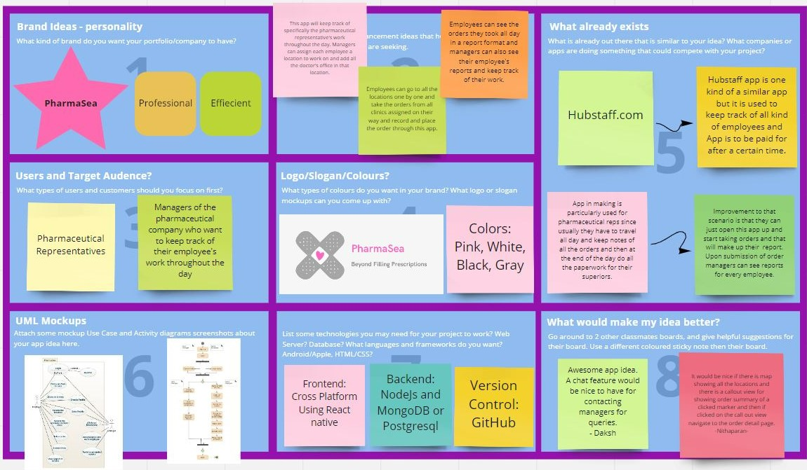

# Brainstorm of my App for Mobile Portfolio 2
# PharmaSea
## Author : Krupa Kirtikumar Shah
## Date : September 24th, 2021

Here you can find overview of my future app with its planning and design ideas for Mobile App Portfolio.

## Intro
I am making this application called PharmaSea which will be about management of pharmaceutical company's employees by their managers throughout the day by getting their status update on the orders they made and the reports generated at the end of the day for each of them.

## Version Control
I am going to use this public repository in GitHub to track my commits made throughout the development of this application with the teaching faculty being collaborator. Since, I am currently in the **inception** phase, you can visit my *miro* site that is running live [here](https://miro.com/app/board/o9J_lwDvtnc=/).

## UML Diagrams

### Use Case for PharmaSea App

## Activity Diagrams

### Activity Diagram for PharmaSea App

